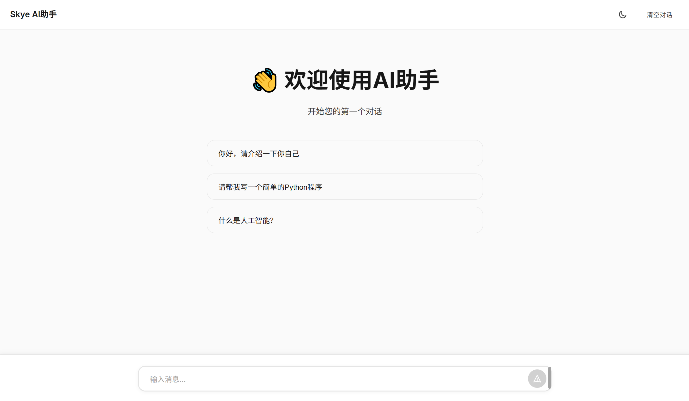

# MiniMax Chat Web

[](https://www.python.org/downloads/)
[](https://fastapi.tiangolo.com/)
[](LICENSE)

基于 FastAPI 和 MiniMax API 的现代化流式聊天应用，支持 AI 思考过程展示和完整 Markdown 渲染。

## 📸 演示


<table>
<tr>
<td width="50%">
<h4>💬 流式对话</h4>
实时展示 AI 回复过程
</td>
<td width="50%">
<h4>🤔 思考过程</h4>
可视化 AI 推理逻辑
</td>
</tr>
<tr>
<td width="50%">
<h4>📝 Markdown 渲染</h4>
支持表格、代码、列表等
</td>
<td width="50%">
<h4>🌙 主题切换</h4>
深色/浅色主题自由切换
</td>
</tr>
</table>

## ✨ 功能特性

- 🌊 **流式响应** - 实时显示 AI 回复，无需等待
- 🤔 **思考过程展示** - 可视化 AI 的推理过程，增加透明度
- 📝 **完整 Markdown 支持** - 优雅展示表格、列表、代码等富文本内容
- 🛠️ **工具调用** - 支持天气查询等扩展功能
- 🌙 **主题切换** - 深色/浅色主题自由切换
- 💾 **本地历史保存** - 自动保存对话历史
- 📱 **响应式设计** - 完美支持移动端和桌面端
- 📋 **一键复制** - 快速复制 AI 回复内容

## 🚀 快速开始

### 1. 克隆项目

```bash
git clone https://github.com/yourusername/minimax-chat.git
cd minimax-chat
```

### 2. 安装依赖

```bash
pip install -r requirements.txt
```

### 3. 配置 API Key

**获取 API Key:**
1. 访问 [MiniMax 平台](https://www.minimaxi.com/)
2. 注册/登录账号
3. 在控制台获取你的 API Key

**设置环境变量:**

**Windows PowerShell:**
```powershell
$env:MINIMAX_API_KEY="your-api-key-here"
```

**Windows CMD:**
```cmd
set MINIMAX_API_KEY=your-api-key-here
```

**Linux/Mac:**
```bash
export MINIMAX_API_KEY="your-api-key-here"
```

**或者使用 .env 文件（推荐）:**

创建 `.env` 文件：
```bash
MINIMAX_API_KEY=your-api-key-here
```

安装 python-dotenv：
```bash
pip install python-dotenv
```

在 `app.py` 开头添加：
```python
from dotenv import load_dotenv
load_dotenv()
```

### 4. 启动服务

```bash
python start.py
```

### 5. 访问应用

在浏览器中打开：[http://localhost:8000](http://localhost:8000)

## 📁 项目结构

```
minimax-chat/
├── app.py              # FastAPI 主应用（包含 API 路由和工具定义）
├── start.py            # 启动脚本
├── requirements.txt    # Python 依赖
├── .gitignore          # Git 忽略文件配置
├── static/
│   └── index.html     # 前端页面（HTML + CSS + JavaScript）
└── README.md          # 项目文档
```

## 🔧 技术栈

- **后端**: FastAPI + Uvicorn
- **前端**: 原生 HTML/CSS/JavaScript
- **AI API**: MiniMax API (通过 OpenAI SDK)
- **流式传输**: Server-Sent Events (SSE)
- **Markdown 渲染**: marked.js + highlight.js

## 📖 API 接口

### POST /api/chat/stream

流式聊天接口，支持工具调用和思考过程展示。

**请求体:**
```json
{
  "messages": [
    {"role": "system", "content": "You are a helpful assistant."},
    {"role": "user", "content": "北京今天天气怎么样？"}
  ]
}
```

**响应格式:** `text/event-stream` (SSE)

**响应数据类型:**

1. **思考过程** (thinking)
```
data: {"type": "thinking", "content": "用户询问北京天气，我需要调用天气查询工具..."}
```

2. **回复内容** (content)
```
data: {"type": "content", "content": "北京今天晴转多云，气温15-25°C"}
```

3. **结束标记**
```
data: [DONE]
```

### GET /api/health

健康检查接口。

**响应:**
```json
{
  "status": "ok",
  "message": "MiniMax Chat服务运行中"
}
```

## 💡 核心功能说明

### 思考过程展示

MiniMax-M2 模型支持展示思考过程（Chain of Thought），通过设置 `reasoning_split=True` 参数启用：

- **思考过程**: 显示在紫色边框区域，展示 AI 如何分析问题
- **最终回复**: 显示在主要内容区域，给出最终答案

**好处:**
- 了解 AI 的推理逻辑
- 增加透明度和可信度
- 学习 AI 如何解决问题

### Markdown 支持

完整支持 Markdown 语法渲染：

| 功能 | 语法示例 | 效果 |
|------|---------|------|
| 标题 | `### 标题` | ✅ 层次分明 |
| 表格 | `\| 列1 \| 列2 \|` | ✅ 整齐美观 |
| 列表 | `- 项目` | ✅ 清晰有序 |
| 粗体 | `**文字**` | ✅ 突出显示 |
| 代码 | `` `code` `` | ✅ 语法高亮 |
| 链接 | `[文字](URL)` | ✅ 可点击 |

### 工具调用

内置天气查询工具，可扩展更多功能：

**示例对话:**
```
用户: 北京今天天气怎么样？
AI思考: 用户询问天气，我需要调用 get_weather 工具
系统: 🔧 正在调用工具: get_weather
系统: 📊 获取到北京的天气信息
AI回复: 北京今天天气晴朗，温度 15-25°C...
```

## ⚙️ 配置说明

### 环境变量

| 变量名 | 说明 | 必需 |
|--------|------|------|
| `MINIMAX_API_KEY` | MiniMax API 密钥 | ✅ 是 |

### 修改端口

编辑 `start.py` 文件：

```python
uvicorn.run(
    "app:app",
    host="0.0.0.0",
    port=8000,  # 修改为其他端口
    reload=True
)
```

### 添加自定义工具

在 `app.py` 中扩展 `tools` 列表：

```python
tools = [
    {
        "type": "function",
        "function": {
            "name": "your_tool_name",
            "description": "工具描述",
            "parameters": {
                "type": "object",
                "properties": {
                    "param_name": {
                        "type": "string",
                        "description": "参数描述"
                    }
                },
                "required": ["param_name"]
            }
        }
    }
]
```

## 🎨 界面功能

- **主题切换**: 点击右上角 ☀️/🌙 图标
- **清空对话**: 删除所有历史消息
- **复制回复**: 悬停在 AI 回复上，点击复制按钮
- **快捷键**:
  - `Enter`: 发送消息
  - `Shift + Enter`: 换行

## 🐛 故障排除

### 问题: 找不到模块

```bash
pip install -r requirements.txt
```

### 问题: API Key 未设置

确保已设置 `MINIMAX_API_KEY` 环境变量：

```bash
# 检查环境变量 (PowerShell)
echo $env:MINIMAX_API_KEY

# 检查环境变量 (Linux/Mac)
echo $MINIMAX_API_KEY
```

### 问题: 端口被占用

修改 `start.py` 中的端口号，或终止占用进程：

```bash
# Windows 查找占用进程
netstat -ano | findstr :8000

# Linux/Mac 查找占用进程
lsof -i :8000
```

### 问题: 连接超时

- 检查网络连接
- 确认可以访问 `https://api.minimaxi.com`
- 检查防火墙设置

### 问题: API 报错

- 验证 API Key 是否有效
- 检查 API 配额是否充足
- 查看服务器日志了解详细错误

## 🔒 安全建议

1. **不要在代码中硬编码 API Key**
   - 使用环境变量管理敏感信息
   - 使用 `.env` 文件 (配合 python-dotenv)

2. **生产环境部署**
   - 使用 HTTPS
   - 配置适当的 CORS 策略
   - 限制请求频率

3. **API Key 泄露**
   - 立即在 MiniMax 平台重置 API Key
   - 检查代码仓库历史

## 📊 性能优化

- 使用异步处理提高并发能力
- SSE 流式传输减少等待时间
- 前端懒加载大型依赖库
- 响应式设计优化移动端体验

## 🤝 贡献

欢迎提交 Issue 和 Pull Request！

## 📄 License

MIT License - 详见 [LICENSE](LICENSE) 文件

## 🙏 致谢

- [MiniMax](https://www.minimaxi.com/) - 提供强大的 AI API
- [FastAPI](https://fastapi.tiangolo.com/) - 现代化的 Web 框架
- [marked.js](https://marked.js.org/) - Markdown 解析器
- [highlight.js](https://highlightjs.org/) - 代码高亮

## 📧 反馈与支持

如有问题或建议，欢迎提交 [Issue](https://github.com/yourusername/minimax-chat/issues)

---

⭐ **如果这个项目对你有帮助，欢迎 Star 支持！**
